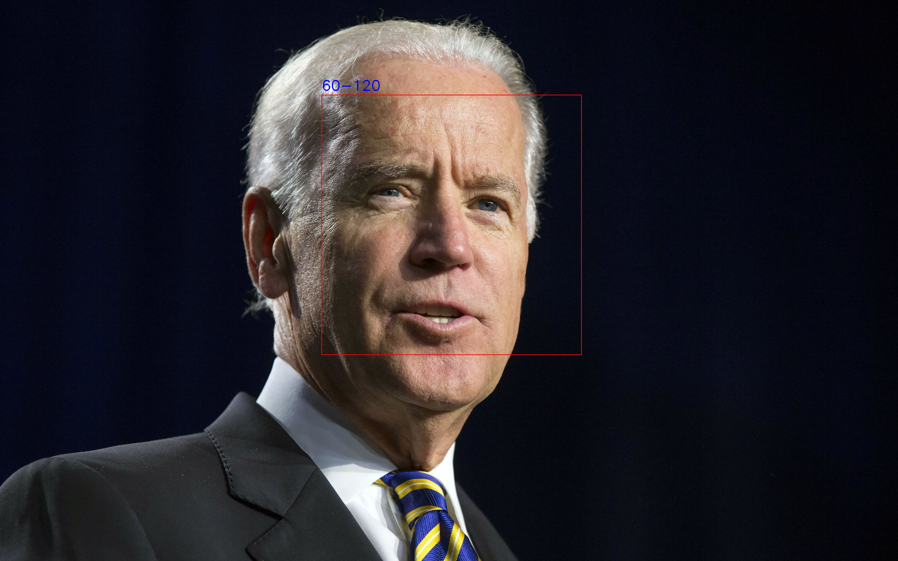

# Real Time Face and Age Detector(RTFAAD)

The following program detects faces from an image file or from camera streams and applies an age detection model that estimates the age of detected face.The program draws a rectangle around the detected face together with the age estimate.

For face detection I will be using OpenCV haarcascade algorithm.

For age estimation I will be using age_detection_model that I had trained using TensorFlow.Check the following [Training an Age Detection model using Tensorflow](https://github.com/KamauDennis/datascience_projects/blob/master/Training_an_Age_Detection_model_using_TensorFlow.ipynb) notebook.

## Requirements
First of all,python 3 must be installed in your system then use pip to install the following libraries;

- opencv
- numpy 
- tensorflow

Download the following [cascades](https://drive.google.com/drive/folders/1AcsA9-WmacZEhtVe7ieCU44jMuGA3z5q?usp=sharing) files required for face detection.

Also,download the [age_detector_model](https://drive.google.com/drive/folders/17h_1o9H3rCf5IOVvJK4WnJrPv-E9pkL4?usp=sharing) for age estimation.

## Usage

To detect faces from a camera run the following command:

`python FaceAgeDetector.py --cam_dev_index <camera device index>`

For a webcam the camera index is 0.

To detect faces from a still image run the following command:

`python FaceAgeDetector.py --img_path <path of the image>`

